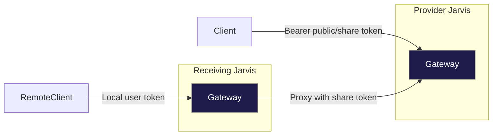

# Token‑Scoped Gateway Module – **Revised Technical Development Plan (v3)**  
*(adds partner access, Jarvis‑to‑Jarvis federation **and** fine‑grained exposure controls)*  

> **Purpose:** deliver a pluggable gateway that applies token‑level ABAC on Milvus + Iceberg, supports external/federated tokens, **and lets admins pick exactly which rows, columns, attachments and vectors are allowed to flow out.**

---

## Table of Contents
1. [Guiding Principles](#guiding-principles)
2. [High‑Level Architecture](#high-level-architecture)
3. [Token Model & Data Changes](#token-model--data-changes)
4. [Component Overview](#component-overview)
5. [API Surface](#api-surface)
6. [Technology Stack](#technology-stack)
7. [14‑Week Development Roadmap](#14-week-development-roadmap)
8. [Detailed Task Breakdown](#detailed-task-breakdown)
9. [Test Matrix](#test-matrix)
10. [Roll‑Out & Ops Playbook](#roll-out--ops-playbook)

---

## Guiding Principles
| Goal | Design Choice |
|------|---------------|
| **Pluggable** | Gateway runs stand‑alone *or* as FastAPI blueprint. |
| **Composable** | Abstract ports for Milvus & SQL; no hard‑wired deps. |
| **Secure by default** | ABAC filters, deny‑all token model, mTLS, column/attachment whitelist. |
| **Observable** | Prometheus metrics, Loki logs, OpenTelemetry traces. |

---

## High‑Level Architecture

---

## Token Model & Data Changes
### 1. Column additions / updates in `tokens`
| Column | Type | Purpose |
|--------|------|---------|
| `token_type` | ENUM(`public`,`share`) | Behaviour switch |
| `provider_base_url` | TEXT | Only for `share` tokens |
| `audience` | JSONB | Optional IP/org restriction |
| `accepted_by` / `accepted_at` | INT, TIMESTAMP | Populated when a receiving Jarvis imports a share token |
| `can_export_vectors` | BOOLEAN DEFAULT FALSE | Allow raw embeddings in export |
| `allow_columns` | JSONB ARRAY | **Column whitelist** for Iceberg projection |
| `allow_attachments` | BOOLEAN DEFAULT FALSE | Toggle attachment download/export |
| `row_limit` | INT DEFAULT 10000 | Hard cap per request/export job |

*(Existing `min_sensitivity`, `allow_rules`, `deny_rules` stay unchanged.)*

### 2. New `external_tokens` table (receiver side)
| Column | Purpose |
|--------|---------|
| `id uuid PK` | internal id |
| `hashed_secret` | bcrypt hash of provider token |
| `provider_base_url` | URL |
| `owner_name` | friendly label |
| `imported_by` / `imported_at` | traceability |
| `is_active` | enable / revoke |

---

## Component Overview
*(unchanged from v2 — Auth Service, Search Proxy, Query Proxy, Export Worker, Share Proxy, Audit Logs)*

---

## API Surface
*(unchanged: Provider `/v1/tokens`, `/download`, `/introspect`; Receiver `/external-tokens/accept|delete`; Search `/v1/search`; Export `/transfer/export`)*  
CRUD now supports the new fields `allow_columns`, `allow_attachments`, `row_limit`.

---

## Technology Stack
*Same as v2 – FastAPI 1.1, Milvus 2.4 SDK, Trino, Celery, Terraform, Prom/Loki/Grafana.*

---

## 14‑Week Development Roadmap
| Phase | Week(s) | Key Deliverables |
|-------|---------|------------------|
| **P0 Scaffold** | 1 | Repo skeleton, Docker image, health‑check |
| **P1 Token CRUD & Scope** | 2‑3 | **Add new columns (allow_columns, allow_attachments, row_limit)**; extend CRUD & TokenScope; unit tests |
| **P2 Search Proxy** | 4‑5 | Column projection enforcement via `allow_columns`; attachment flag respected in results |
| **P3 Iceberg Query Proxy** | 6 | ABAC SQL util honours whitelist, row_limit |
| **P4 Export Worker** | 7‑8 | Skip or include attachments/vectors based on token flags; audit counts |
| **P4′ Share Token Download** | 8 | unchanged |
| **P5 Security + Exposure Tests** | 9 | rate‑limit, mTLS + new tests: column leakage, attachment leakage |
| **P5′ External Token Accept** | 9 | unchanged |
| **P6 Observability** | 10 | Metrics for blocked columns, attachment redactions |
| **P7 Helm Chart** | 11 | unchanged |
| **P8 Federation Proxy** | 12 | unchanged |
| **P9 QA & Pen‑Test** | 13‑14 | update checklist with column/attachment cases |

> **Timeline remains 14 weeks** — new work absorbed in P1–P5 without extra weeks.

---

## Detailed Task Breakdown
| Epic | New Task Highlights | Owner |
|------|--------------------|-------|
| Back‑end Core | • Migrations for new columns • Extend Token CRUD schemas & validators • Update TokenScope logic | **BE‑1** |
| Search / Query | • Apply `allow_columns`, `row_limit` projection & limit | **BE‑2** |
| Export Worker | • Respect `allow_attachments`, `can_export_vectors` | **DE‑1** |
| Security | • Write unit & integration tests for column/attachment leakage | **SEC‑1** |
| Front‑end | • Add multi-select “Columns allowed” • Attachment / vector toggles | **FE‑1** |

---

## Test Matrix
| Layer | Happy Path | Negative / Edge | Perf |
|-------|-----------|-----------------|------|
| Column whitelist | only whitelisted cols returned | request extra col → blocked | negligible |
| Attachment toggle | flag false → no attachment data | forced download route → 403 | — |
| Row limit | 9,999 rows allowed | 10,001 rows → truncated | maintains SLA |
| Federated proxy | search obeys upstream allow_columns | mismatch schemas handled | +≤30 ms |

---

## Roll‑Out & Ops Playbook
1. **Migration** – run Alembic to add three new columns.  
2. **Blue/Green** deploy gateway v3.  
3. **Smoke tests** – token with single column allowed, attachment off, >row_limit.  
4. **Monitoring** – alert on `leak_block_count` anomalies.  
5. **Revocation** – same as v2.

---

### Outcome
Version 3 completes the governance story: **row‑level**, **column‑level**, **attachment**, **vector**, and **rate‑based** controls are all driven by the token record—making the gateway a one‑stop policy engine for every Milvus & Iceberg data access path.
